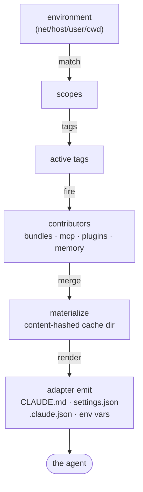
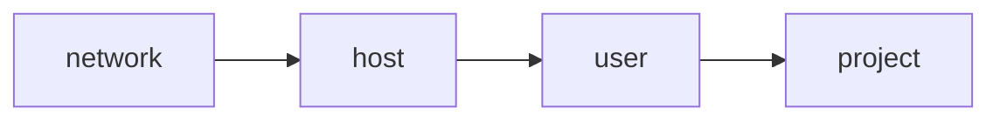

# Concepts

llmenv resolves your environment through one fixed pipeline:



## Scopes

A **scope** answers "where am I?". There are four kinds:

| Kind | Matches on | Declared in |
|------|-----------|-------------|
| `network` | gateway MAC address | `config.yaml` under `scope.network` |
| `host` | hostname (case-insensitive) | `config.yaml` under `scope.host` |
| `user` | `$USER` | `config.yaml` under `scope.user` |
| `project` | a `.llmenv.yaml` marker file | the project tree itself (not `config.yaml`) |

Network, host, and user scopes are statically configured. The **project** scope
is *discovered*: llmenv walks the current working directory upward — stopping at
`$HOME` — looking for a `.llmenv.yaml` marker. The deepest marker found wins.
This keeps per-project configuration with the project, not in a central file. See
[Project markers](#project-markers) below.

Each scope carries a list of `tags`. A scope is *active* when its match
condition holds; all active scopes contribute their tags to the active set.

> Note: `network` matching currently uses `gateway_mac` only. The `ssid` and
> `cidr` match fields parse but are not yet evaluated.

## Tags

**Tags** are the join key between scopes and everything they select. They have no
meaning of their own — they are arbitrary labels you choose (e.g. `office`,
`rust`, `me`). A contributor activates when **any** of its tags is in the active
set.

## Contributors

Four things select onto scopes by tag intersection, all with identical
semantics:

- **Bundles** (`bundle:`) — environment variables plus an optional content
  directory of files (`<config_dir>/bundles/<name>/`) merged into the agent
  config.
- **MCP servers** (`mcp:`) — stdio or remote Model Context Protocol servers.
- **Plugin collections** (`plugin-collection:`) — named bags of
  `marketplace:plugin` references.
- **Memory backend** (`memory:`) — llmenv's own networked memory service.

A bundle can also be force-enabled by name through a project marker's
`enable_bundles` list, independent of its tags — the escape hatch for "always
load this bundle in this repo". The negative counterpart, `disable_bundles`,
removes a bundle a broader scope's tag turned on — "never load this bundle in
this repo", even though a user- or network-scope tag would otherwise fire it.

## Materialize

All firing contributors are merged into a single **manifest**, which is written
to a directory under the cache. The folder name depends on the `cache.hashing`
mode:

```
# loose: folder named by content shape only
<cache_dir>/<adapter>/<shape>/

# normal (default): folder named by version + content shape
<cache_dir>/<adapter>/<version_mm>/<shape>/

# strict: folder named by version tag + full content hash
<cache_dir>/<adapter>/<VERSION_TAG>-<content_hash>/
```

Where `shape` is a 12-hex SHA-256 over the active tags ∪ enabled bundles.

- **`loose`** — no version component; the folder is stable across binary upgrades.
  Content edits re-render into the same folder.
- **`normal`** (default) — folder name includes the major.minor version. Churns on
  minor version bumps; stable within a release. Content edits re-render into the
  same folder, so a running agent only picks up changes when you relaunch it. This
  keeps the folder stable for the whole session — important because that folder is
  the agent's live config dir and holds in-session state llmenv doesn't own
  (Claude's runtime files, third-party plugin state). The content hash lives in
  the manifest dotfile (below), not the folder name.
- **`strict`** — folder is `<VERSION_TAG>-<content_hash>`. Any input change mints a
  fresh folder, so re-materializing identical inputs is free and configs never
  collide. Strongest isolation at the cost of cache fragmentation.
- Every materialized folder gets a `.llmenv-manifest.json` dotfile recording the
  content hash and the **set of files llmenv owns** in that folder. The hash
  drives drift detection; the owned set drives reconciliation.
- **Reconciliation (version mode):** on re-render, a file llmenv owned last time
  but not this time (a dropped `rules/*.md`, a removed plugin) is deleted, while
  any file llmenv never owned is left untouched. `settings.json` is *merged*, not
  overwritten, so a plugin that self-registered a hook into it survives.
- `VERSION_TAG` is `<pkg_version>-<git_short_hash>` (baked in at build time).
- Plugin marketplaces are cloned once into `<cache_dir>/marketplaces/<name>/` and
  shared across scopes; the resolved git HEAD is mixed into the content hash so a
  marketplace update re-renders.
- Partial writes (strict mode) stage as `*.tmp` directories and are cleaned by
  `prune` / `doctor --gc`.

## Adapter emit

An **adapter** renders the materialized manifest into an engine's native shape.
The Claude Code adapter writes `CLAUDE.md` (rules) and `settings.json`
(permissions, hooks, plugins) — both with `0600` permissions — and merges
resolved MCP servers into the `mcpServers` object of `.claude.json` (preserving
any foreign keys the user or plugins wrote there). It then returns the env vars
that point the agent at the directory (`CLAUDE_CONFIG_DIR`). It also registers a `SessionStart` hook running
`llmenv check-stale`, which compares the content hash recorded in the booted
folder's `.llmenv-manifest.json` against the hash llmenv would render now and
warns you to restart when they differ. This is what surfaces an in-place
re-render in `version` mode, where the folder name alone never changes.

See [Engines](engines.md) for the capability model and per-engine escape
hatches.

## Precedence

When scopes of different kinds set conflicting **scalar** values (e.g. a
permission `default_mode`), the more specific scope wins. The order, least to
most specific:



List-shaped values (permission allow/ask/deny lists, hooks, plugins) concatenate
and de-duplicate across all contributors rather than overriding.

Bundle firing is the exception to pure list-concatenation: a project marker's
`disable_bundles` always wins over any scope's tag-firing or `enable_bundles`
for the named bundle — including that same project marker's own
`enable_bundles`, if it lists the same name. Project is already the
highest-precedence scope, so this falls out of the same least-to-most-specific
order above; there is no separate precedence rule to remember.

## Introspection

After resolution, `llmenv export` emits the active context as environment
variables so the agent and your shell can read it back:

| Variable | Format |
|----------|--------|
| `LLMENV_ACTIVE_SCOPES` | `kind:id,…` |
| `LLMENV_ACTIVE_TAGS` | `tag,…` (sorted) |
| `LLMENV_ACTIVE_BUNDLES` | `name,…` (declaration order) |
| `LLMENV_ACTIVE_PROJECT` | deepest project scope id (omitted if none) |
| `LLMENV_PROJECT_ROOT` | absolute path of the deepest marker (omitted if none) |
| `LLMENV_ICM_CONTEXT` | tags/bundles encoded for tag-scoped memory |

## Project markers

A project marker is a `.llmenv.yaml` file at the root of a project. Every field
is optional; an empty file is valid.

```yaml
id: myapp                       # defaults to the folder basename
name: MyApp                     # defaults to the folder basename
description: "Customer API"     # capped at 1024 bytes; surfaced into agent context
tags: [myapp, rust]             # joined into the active tag set
enable_bundles: [base]          # force-enable bundles regardless of their tags
disable_bundles: [yaks]         # force-disable bundles even if a scope's tag enables them
```

**Worked example:** a user-scope tag enables the `yaks` bundle (task tracking)
globally, since most projects use it. One project uses GitHub Issues instead:

```yaml
enable_bundles: [github-issues]
disable_bundles: [yaks]
```

This project now loads `github-issues` and never loads `yaks`, regardless of
what the user scope's tags would otherwise fire.

Discovery rules:

- The walk starts at the current directory and ascends **to `$HOME` inclusive**,
  then stops. A marker above `$HOME` (e.g. in `/tmp` on a shared host) is
  ignored — a deliberate guard against hostile markers.
- When `$HOME` is unknown, only the current directory itself is checked.
- Malformed YAML degrades gracefully: a warning is logged and a minimal project
  is used, with `id`/`name` taken from the folder basename.
- Unknown fields are collected and reported by `llmenv doctor`.
